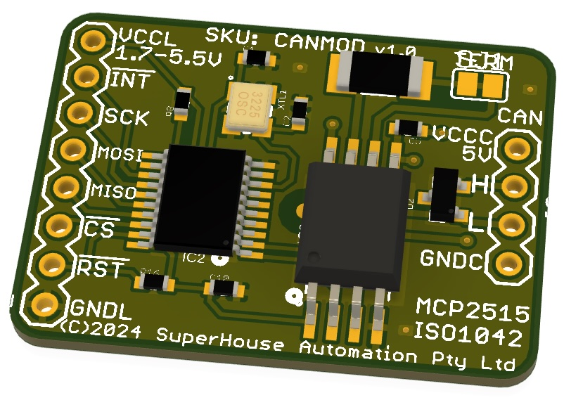

Fully Isolated CAN Bus Module
=============================

Copyright 2024 SuperHouse Automation Pty Ltd  [www.superhouse.tv]()

CAN bus module with an SPI interface and a fully-isolated transceiver and dual power
rails, allowing full-range CAN voltage when driven with a 3.3V microcontroller. The
transceiver is rated to 70V isolation on bus faults, protecting the microcontroller
from extreme transient voltages.

This module was designed as a building block for rapidly creating Test Modules for
the [Testomatic PCB Test Jig System](https://github.com/superhouse/testomatic). It
allows the tester to communicate with a target Device Under Test via CAN bus. However,
there is nothing specific about Testomatic in this module so it can be used for any
project that requires an isolated on non-isolated CAN controller and transceiver.

## Features
* MCP2515 CAN Controller
* ISO1042 isolated CAN Transceiver
* Split GND for logic and bus isolation if required
* Compatible with MCU logic levels from 1.7V to 5.5V
* Onboard CAN termination

CAN termination is enabled by default, via a cut-track jumper at the top right of the
module labelled "TERM". To disable termination, cut the small track between the solder
pads. The track can be bridged again later with solder if required.

CAN termination is provided by a high-power 120R resistor, rated to withstand a dead
short between either of the CAN bus lines and 12V vehicle power.

## Pinout
* **VCCL**: Logic voltage to suit the connected microcontroller. Maximum range 1.7V - 5.5V
* **!INT**: Interrupt output from MCP2515 CAN controller (active low)
* **SCK**: SPI Clock input
* **MOSI**: SPI MOSI input
* **MISO**: SPI MISO output
* **!CS**: SPI chip select (active low)
* **!RST**: Reset input (active low, with onboard pullup)
* **GNDL**: Logic-side GND
* **VCCC**: CAN-side supply voltage. Nominal 5V
* **H**: CAN High
* **L**: CAN Low
* **GNDC**: CAN-side GND

GNDL and GNDC are isolated on the module, with full galvanic isolation provided by the transceiver. In typical installations without full isolation, these two GNDs can be connected together.

When running from a 5V MCU and isolation is not required, both VCCL and VCCC can be supplied from the same power rail. This removes the galvanic isolation between the bus and the controller.

## Installation
Schematic and PCB were created in Fusion360 and exported as EAGLE format,
which can be imported back into Fusion360 or various other packages including KiCAD.

## Credits
Designed by Jonathan Oxer <jon@oxer.com.au>.

## Distribution
The specific terms of distribution of this project are governed by the
license referenced below.

## License
Licensed under the TAPR Open Hardware License (www.tapr.org/OHL).
The "license" folder within this repository also contains a copy of
this license in plain text format.
